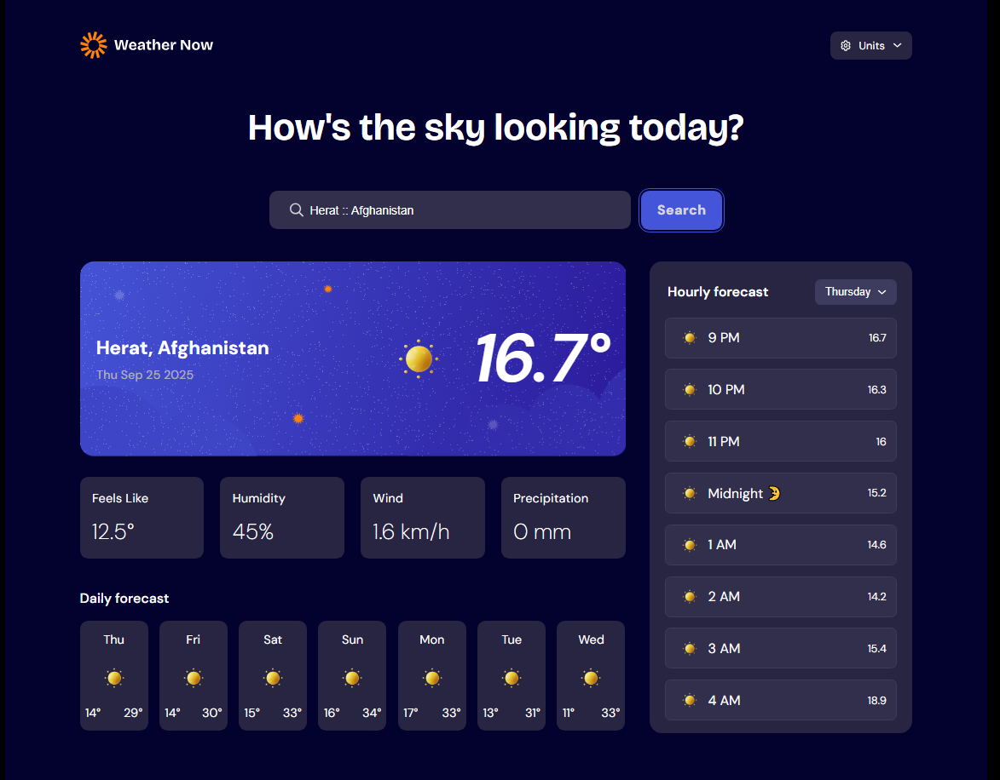

# Frontend Mentor - Weather app solution

This is a solution to the [Weather app challenge on Frontend Mentor](https://www.frontendmentor.io/challenges/weather-app-K1FhddVm49).

## Table of contents

- [Frontend Mentor - Weather app solution](#frontend-mentor---weather-app-solution)
  - [Table of contents](#table-of-contents)
  - [Overview](#overview)
    - [The challenge](#the-challenge)
    - [Screenshot](#screenshot)
    - [Links](#links)
  - [My process](#my-process)
    - [Built with](#built-with)
    - [What I learned](#what-i-learned)
    - [Continued development](#continued-development)
        - [Inkscape- - This software helped me edit the svg file in order to make the entry animation.](#inkscape----this-software-helped-me-edit-the-svg-file-in-order-to-make-the-entry-animation)
  - [Author](#author)

## Overview

### The challenge

Users should be able to:

-   Search for weather information by entering a location in the search bar
-   View current weather conditions including temperature, weather icon, and location details
-   See additional weather metrics like "feels like" temperature, humidity percentage, wind speed, and precipitation amounts
-   Browse a 7-day weather forecast with daily high/low temperatures and weather icons
-   View an hourly forecast showing temperature changes throughout the day
-   Switch between different days of the week using the day selector in the hourly forecast section
-   Toggle between Imperial and Metric measurement units via the units dropdown
-   Switch between specific temperature units (Celsius and Fahrenheit) and measurement units for wind speed (km/h and mph) and precipitation (millimeters) via the units dropdown
-   View the optimal layout for the interface depending on their device's screen size
-   See hover and focus states for all interactive elements on the page
-   Now can also scroll between resulted cities in the dropdown result while searching.

### Screenshot

### Links

-   Solution URL: [Add solution URL here](https://github.com/AssafBenIshay/Weather-App)
-   Live Site URL: [Add live site URL here](https://weather-app-one-tau-27.vercel.app/)

## My process

### Built with

-   Flexbox
-   CSS Grid
-   PC-first workflow
-   [React](https://reactjs.org/) - JS library

### What I learned

This challenge i've learned how to sync 3 different API's

### Continued development

At the beginning i've started this project using TypeScript,I would not recommend it to a beginner before diving in into the TS world.What I did actually learn is that is relatively easy to convert TypeScript project files to React JSX files.

##### [Inkscape](https://inkscape.org/)- - This software helped me edit the svg file in order to make the entry animation.

## Author

-   Website - [Assaf Ben-Ishay](https://ben-ishay-assaf.vercel.app/)
-   Frontend Mentor - [@AssafBenIshay](https://www.frontendmentor.io/profile/AssafBenIshay)